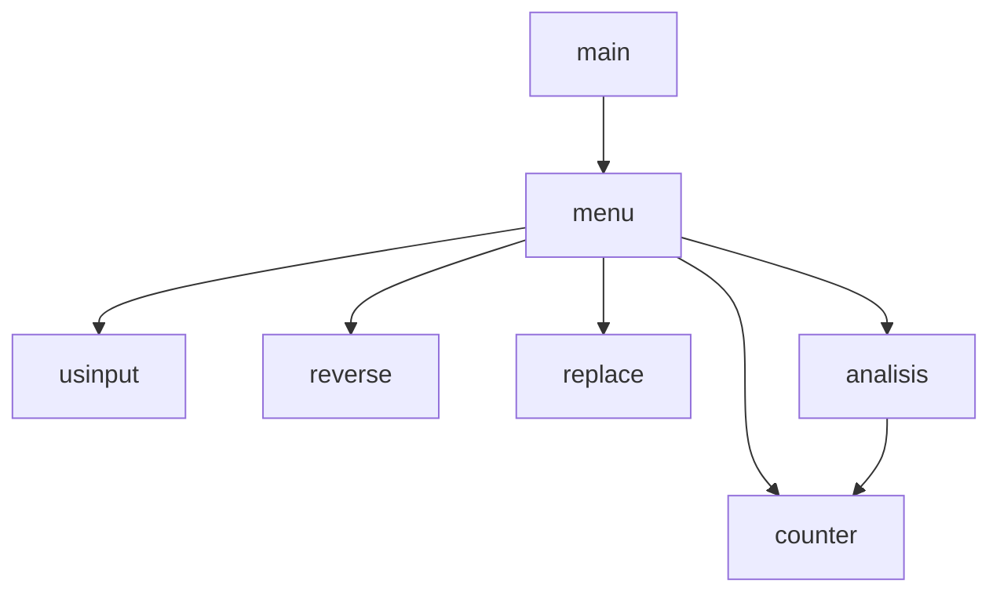

# python-chapter-8-team-p2-
anthony,jacob,evan

##  Description
let some one make a string of at least 5 letters and only letters then lets them mess with it

###  Flowchart

#### Function Diagrams

| usinput    |               |   anthony   |
| ------------------ | ------------- | ------------ |
|   ecsepts nothing  | takes input from user |     returns user input      |  
***
| reverse    |               |     evan   |
| ------------------ | ------------- | ------------ |
|  ecsepts user input  | outputs the reversed input |        returns the reversed input      |

***
| counter    |               |     jacob   |
| ------------------ | ------------- | ------------ |
|  ecsepts user input  | outputs constens and vowles  |       returns the number of constens and vowles       |

***
| `replace`    |               |    jacob    |
| ------------------ | ------------- | ------------ |
|  ecsepts user input   | outputs the new input  |     returnes the changed input         |
***
| `menu`    |               |    anthony    |
| ------------------ | ------------- | ------------ |
|  ecepts nothing   | prints a menu to select from  |  returns the selection to main   |       
***
| `analysis`    |               |   evan     |
| ------------------ | ------------- | ------------ |
|  ecsepts user input   | calls counter then outputs if palindrome and total number of letters  |      returns nothing        |
***
