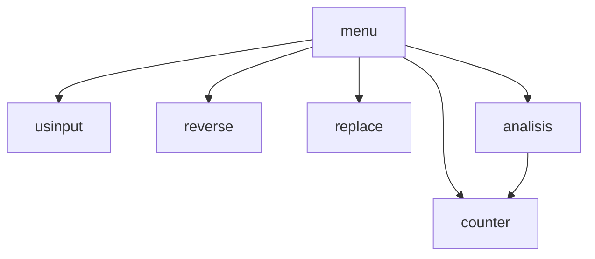

# python-chapter-8-team-p2-
anthony,jacob,evan

##  Description
let some one make a string of at least 5 letters and only letters then lets them mess with it

###  Flowchart

#### Function Diagrams

| usinput    |               |   anthony   |
| ------------------ | ------------- | ------------ |
|     |  |             
***
| reverse    |               |     evan   |
| ------------------ | ------------- | ------------ |
|    |  |              |

***
| counter    |               |     jacob   |
| ------------------ | ------------- | ------------ |
|    |   |              |

***
| `replace`    |               |    jacob    |
| ------------------ | ------------- | ------------ |
|     |   |              |
|      |   |              |
|       |  |  |
***
| `menu`    |               |    anthony    |
| ------------------ | ------------- | ------------ |
|     |   |              |
|      |   |              |
|       |  |  |
***
| `analysis`    |               |   evan     |
| ------------------ | ------------- | ------------ |
|     |   |              |
|      |   |              |
|       |  |  |
***
