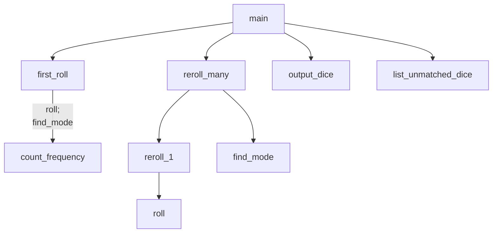

# python-chapter-8-team-p2-
anthony,jacob,evan

##  Description
let some one make a string of at least 5 letters and only letters then lets them mess with it

###  Flowchart

#### Function Diagrams

| main    |               |  anthony    |
| ------------------ | ------------- | ------------ |
| Recieves no arguements    | calls all the programs to run the game |   outputs nothing          
***
| roll    |               |     anthony   |
| ------------------ | ------------- | ------------ |
| recives no arguments   | calls for the first roll |     outputs nothing         |

***
| output dice    |               |     anthony   |
| ------------------ | ------------- | ------------ |
| recivies no arguments   | outputs the dice to view the numbers  |    outputs nothing          |

***
| `first_roll`    |               |     evan   |
| ------------------ | ------------- | ------------ |
|     | takes input from the user for roll count  |              |
|      | calculates same dice rolled  | outputs nothing             |
|       | takes input for name dice | returns total |
***
| `count_frequency`    |               |     evan   |
| ------------------ | ------------- | ------------ |
|     | takes input from the user for roll count  |              |
|      | calculates dice  | outputs constant             |
|       | takes input for name dice constant | returns total |
***
| `find_mode`    |               |     evan   |
| ------------------ | ------------- | ------------ |
|     | takes input from the main for mode / constant  |              |
|      | calculates dice same  | outputs dice numb             |
|       | takes input for name dice constant_ | returns total |
***
| `list_unmatched_dice`    |               |     Jacob   |
| ------------------ | ------------- | ------------ |
|     | takes input from the reroll_many for index |              |
|       |  | returns index |
***
| `reroll_one`    |               |     Jacob   |
| ------------------ | ------------- | ------------ |
|     | takes input from the reroll_many for deleating  |              |
***
| `reroll_many`    |               |     Jacob   |
| ------------------ | ------------- | ------------ |
|     | takes input from the main for reroll_one and list_unmatched_dice  |       outputs list of dice       |
***
